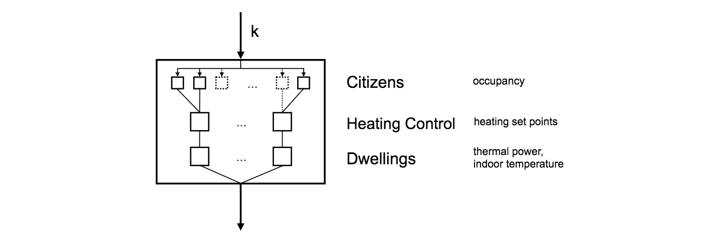

# Introduction and Related Works

Accounting for 34% of global energy end-use, the building sector is the largest energy sink and a major contributor to global CO~2~ emissions [@GEA:2012us]. Three quarters of this amount are accountable for space heating and cooling purposes. When trying to reduce this energy impact,  understanding the energy demand originating in the building sector and its drivers is crucial. With more than half of the global population living in cities and with on-going urbanisation [@UnitedNations:2014uy], urban built environments are becoming more important in this regard. This is even more so true when looking at America or Europe where the urban population exceeds 70% of the total population already today [@UnitedNations:2014uy]. Estimations of energy demand for space heating are valuable during the design phase of urban built environment and its energy supply infrastructure, but also for effective retrofitting actions and incremental performance evaluations. In particular, the task of designing efficient energy supply systems asks for a high temporal resolution of the estimation [@Omu:0ca]. The built infrastructure and other factors impacting energy demand for space heating are diversely distributed in urban environments and hence analyses have recently been done on a high spatial resolution as well [@Choudhary:0kp; @Li:wp; @Anonymous:0gi].

While thermodynamic models of buildings are well understood and assumed to achieve good results, simulated energy demand for space heating in urban environments deviate largely from measured data which is often accounted to micro-climate effects [@Kolokotroni:2008kg; @Steemers:2003kd] and to the impact of occupants [@GuerraSantin:2012im; @Seryak:2003hn; @Fabi:2012gu; @Janda:2011cy]. "Buildings don't use energy: people do" [@Janda:2011cy] and hence the energy usage in a building can be accounted directly or indirectly to the way people use buildings. In residential buildings, people's impact on space heating demands stems mostly from the way people control the heating, ventilation, and air conditioning (HVAC) systems, the way people actively ventilate their buildings through window and door opening, the way people shade their rooms through blinds and curtains, the way people functionally divide their residential homes, and people's occupancy and activities performed at home which attribute in the form of heat gains [@VanRaaij:1983kt; @Paauw:2009uw]. Given the complex nature of human behaviour a comprehensive understanding of the driving forces, relationships, and feedbacks is difficult. Several factors like awareness [@Janda:2011cy], socio-economic situations [@Druckman:2009kx], and rebound effects [@Edelson:1980gj; @Brannlund:2007jg] are discussed in the literature. Given the trend towards zero-energy buildings in which thermal losses from the building fabric are significantly reduced, the impact of occupants on energy demand is relatively increasing [@Janda:2011cy]. This trend emphasises the importance of quantifying the influence of occupants on energy consumption.

On the city scale, former work include high resolution energy models without explicit influence of occupancy [@tian2015high; @zhang2015gshp; @Li:wp], and models including people behaviour but only in aggregated form on lower spatial resolution [@BustosTuru:2016ee].

The behaviour of occupants in energy simulation is typically represented through several sub-models. The foundation to most of them lies in determining time periods when the building is occupied [@Richardson:2008dj; @Aerts:2015ko; @Widen:2009fo]; sometimes even disaggregated into zones of the building [@Liao:2012et]. On top of those, more detailed activity models [@Widen:2009kx; @Aerts:2015ko], window opening models [@Andersen:2013cn; @Fabi:2013tl], and HVAC control models [@Fabi:2013ch] are placed. Behaviour models are typically differentiated between deterministic and probabilistic types. Deterministic models assume a direct causal link between a driver of a certain behaviour and the actual derived action. While different methods exist, these types of models are based on rational decision making. Probabilistic models in contrast are based on likelihoods of different actions. The data source for occupancy and activity models in many cases is the so-called time use survey (TUS) data sets for which a standardising research centre exists [@ctus].

This paper reports the progress of on-going work of introducing people occupancy models to high resolution bottom-up city models. The model estimates energy demand for space heating in residential buildings on a city scale. Energy demand is driven by the occupancy of people in their households which itself is modelled through a time-heterogeneous Markov chain based on TUS data. Citizens are clustered through features of themselves and of the households they live in. A statistically viable urban population is formed through population synthesis. The model allows analyses of spatio-temporal patterns of energy use for space heating across a given district. It is implemented as an open-source agent-based model [@energyagents] which allows easy integration of other bottom-up effects impacting energy demand for space heating like people movement, people interactions, activity models, and urban microclimates, other energy uses like water heating and electricity, other environmental impacts e.g. on air quality, or the supply side of building energy.

This paper is structured as follows: section 2 describes the conceptual model and a general way how time use data and census data can be used to calibrate it. Simulation results for a representative study of the London Borough of Haringey are presented in section 3, and section 4 concludes the findings.

# Methodology

## Conceptual Model

The general urban energy system as applied in this study consists of three distinct entities: citizens, HVAC controls, and dwellings whose models will be described in detail in the following sub sections. A dwelling forms a home for one to $n$ citizens and incorporates exactly one HVAC control system. Fig. @fig:flow-chart-time-step shows a flow-chart of the model. The model is time-step based where in each time step $k$, each entity updates its state: first all citizens update their occupancy, i.e. determine whether they are at home or not. Second, the HVAC control system of each dwelling updates its heating set point, taking into account the occupancy of the dwelling. Lastly, each dwelling updates its indoor temperature and the thermal power needed for reaching it.

{#fig:flow-chart-time-step .class width=500}

### Heating System Control Model

The heating set point $\theta_{set, z}$ for a heating zone $z$ can be understood as a function of $P_z$, the set of people inside the heating zone or related to it; $L_{P_z}$ and $A_{P_z}$, the locations and activities of those people; and $B_{P_z}$, the heating behaviour which itself is influenced by many -- often unknown -- aspects like the comfort zone, awareness, socio-economic situation, and usage patterns of $P_z$.

For the simulation model of the heating system controls applied in this study, the following simplifications are made compared to the general model as defined above:

* zones are entire dwellings;
* time is discrete;
* location is equal to presence, i.e. we do not incorporate indoor positions;
* heating behaviour is based on three occupancy modes as described below.

The smallest unit considered is a dwelling $d$, by which we mean the fraction of a building that has a distinct energy meter and is occupied by a single household. Each dwelling $d$ is of the set $D$, i.e. of the urban residential building stock. $P_k^d$ is defined as a subset of the entire urban population $P$ comprising of all people that occupy dwelling $d$ at time $k$. Given these definitions, the heating set point for dwelling $d$ at time $k \in K$ is defined as:

$$\theta_{set, k}^d = \begin{cases}
    \theta_{set, absent}^d,   & \text{if } P_k^d = \varnothing\\
    \theta_{set, active}^d,   & \text{if } \{p \in P_k^d | \text{p is active}\} \neq \varnothing\\
    \theta_{set, passive}^d,  & \text{otherwise}
\end{cases}.$$

In this model, there are three distinct heating set points between which the control system toggles depending on occupancy. It shall be noted that assuming a desired comfort level defined by the set point temperatures $\theta_{set, absent}^d \leq \theta_{set, passive}^d \leq \theta_{set, active}^d$ this controller is close to optimal in terms of energy efficiency as the dwelling is minimally heated. As indoor temperature lags behind occupancy it is not optimal in terms of comfort level. This effect is particularly strong when occupants enter a dwelling whose indoor temperature is far from $\theta_{set, active}^d$ or $\theta_{set, passive}^d$, but is ignored in this study.

### Occupancy Model

Citizens are modelled solely by the occupancy in their respective dwellings, using a probabilistic occupancy model that has been applied in several studies, albeit at the scale of single dwellings [@Richardson:2008dj; @Widen:2009fo; @Aerts:2015ko]. The occupancy model consists of a time-heterogeneous Markov chain with the following states: (1) not at home, (2) active at home, and (3) asleep at home. As the Markov chain is time heterogeneous, transition probabilities between the states of the Markov chain are time dependent, and hence the transition matrix for person $p$ at time $k$ can be given as:

$$
Pr^p =
\begin{bmatrix}
    p_{11}^p(k)&p_{12}^p(k)&p_{13}^p(k)\\
    p_{21}^p(k)&p_{22}^p(k)&p_{23}^p(k)\\
    p_{31}^p(k)&p_{32}^p(k)&p_{33}^p(k)
\end{bmatrix}.
$$

Every person has exactly one home, so we can define a time-invariant set of people $P_d$ for every dwelling $d$ such that the family of sets $P_D = \{P_d | \forall d \in D\}$ form a partition of population $P$ and $\cup_{d \in D} P_d = P$ and $P_{d_1} \cap P_{d_2} = \varnothing \ \forall \ d_1 \neq d_2$ hold. The time dependent set of occupancy of dwelling $d$ at time $k$ as used in the heating system control model can then be given as $P_k^d = \{p \in P_d | \text{p is active at home or p is asleep at home} \}$.

<!--- TODO add initial state --->

### Thermal Model of the Dwellings

Dwellings are modelled following the simple hourly dynamic model of EN ISO 13790 [@cen13790:2008]. Each dwelling is represented as a single thermal zone with squared floor area which is entirely heated. The dwelling consists of only one storey with equally sized windows facing north, south, east, and west. Ventilation and infiltration is limited to constant natural ventilation, and heat gains are limited to metabolic heat gains. Furthermore, heat transfer between dwellings is ignored.

The unknown and bounded heating power $\Phi_{HC, nd, k}^d$ is determined by the need to reach the set point temperature as defined by the heating system control. According to [@cen13790:2008] it is assumed that the controller has a perfect dwelling model and can hence determine the necessary heating power in a precise manner.

## Simulation Model

The distinct sub models of the heating control systems, the dwellings, and the citizens, are linked and implemented in an open-source simulation model [@energyagents]. While the conceptual models as defined above would allow for a separate, three stages approach of simulation, in which citizens occupancy is simulated first, heating set points are simulated consecutively, and indoor temperatures and thermal powers of dwellings are simulated as a last step, the model has been implemented in an agent-based manner in which these three stages are simulated consecutively. This will allow amending the model by aspects which add other relationships between the layers than the one depicting in Fig. @fig:flow-chart-time-step.

## Model Calibration

The following subsection describes methods to calibrate the conceptual model as defined above. In particular two types of data sets are taken into account: (1) time use survey (TUS) data and (2) aggregated census data, which both are available for many regions of the world, and in the case of TUS data, even in a standardised manner [@ctus]. The TUS data is used to calibrate the occupancy model, whereas the aggregated census data is used to generate a synthetic population. In addition to these, a micro sample of census data is necessary, i.e. fully detailed census data for a fraction of the population. For the approach described in this study, that data must be available in the TUS data set, i.e. for each participant whose time use is recorded in the study, we will demand features of the participant as well, e.g. their socio-economic situation.

### Occupancy Model

The transition matrix $Pr^p$ for each citizen is derived from the TUS data set. The TUS data set contains location and activity data for each participant at a high temporal resolution in the form of a diary. Diaries span at least a day, though typically a weekday and a weekend day are recorded as time use varies between these days [@ctus]. In the following, a mapping is performed from each tuple of location and activity to one of the states of the Markov chain. As an example, the tuple (location = 'workplace or school', activity = 'lunch break') is mapped to 1 = not at home, as is (location = 'second home or weekend house', activity = 'sleep'). After the mapping, each diary can be understood as a concrete instance of a stochastic process that is described by the time heterogeneous Markov chain of the occupancy model. The set of participants is clustered by one or more household or people features $F$, e.g. age, which is available in both, the TUS data set and the aggregated census, and a time-heterogeneous Markov chain for each cluster following the approach used e.g. by [@Richardson:2008dj; @Widen:2009fo] is created. The resulting set of transition matrices $\{Pr^f| \forall f \in F\}$ then allows us to deterministically allocate a transition matrix to a citizen based on the citizens feature value $f^p$: $Pr^p = Pr^{f^p}$.

The choice of household or people features is important for the quality of this approach. While theoretically all features could be used, in practise this might lead to sample sizes of that type of person which is too small. Hence, a subset of features must be chosen. Unfortunately we are not aware of a deterministic way of choosing the _correct_ subset of features. We instead acknowledge the inherent uncertainty and analyse features, their correlation among each other, and their correlation to the derived time series. We furthermore discuss the sensitivity of the results to the choice of features in the case study performed.

### Synthetic Population

The urban scale occupancy model as described above needs information on the composition of every household, and household and people feature vectors $f^p$ for every individual $p$ in the population of the study area. Such disaggregated data is typically not available and hence the population is synthesised from aggregated census data and typical population compositions given by micro samples of census data. Population synthesis as a way to initialise micro-simulations has been applied in the past mainly in land use and transportation models [@Beckman:1996hv; @Arentze:2007cf] but more recently in energy models as well [@Anonymous:sQCtxREz]. [@Muller:2010vx; @Barthelemy:2012ws] provide overviews over the different approaches that are available.

In population synthesis, the aim is to estimate the joint probability mass function $p_{F}$ for a set of $n$ features $F = \{F_1, F_2, ..., F_n\}$ which describes the correct distribution of those features in the actual population, given a set of marginal probability mass functions $p_{\tilde{F}}$ for a subset of features $\tilde{F} \subset F$. A simple example for the two-dimensional case of $F = \{\text{sex, age}\}$ is given in Table @tbl:popsynth-example, a contingency table in which the last column shows the probability mass function for the feature 'sex', the last row shows the probability mass function for the feature 'age', and the centre shows the unknown joint probability mass function $p_F$.

+--------+----------------------------+----------------------------+-------------------+
|        | below age 50               | above age 50               |                   |
+--------+----------------------------+----------------------------+-------------------+
|  male  | $p_F(\text{male, < 50)}$   | $p_F(\text{male, > 50)}$   | $p_{sex}(male)$   |
+--------+----------------------------+----------------------------+-------------------+
|  female| $p_F(\text{female, < 50)}$ | $p_F(\text{female, > 50)}$ | $p_{sex}(female)$ |
+--------+----------------------------+----------------------------+-------------------+
|        | $p_{age}(< 50)$            | $p_{age}(> 50)$            |                   |
+--------+----------------------------+----------------------------+-------------------+

Table: A two dimensional population synthesis problem. {#tbl:popsynth-example}

In the case of this study, the relationship between households and people must be retained when creating the synthetic population. Solutions for such hierarchical problems have been discussed in the past [@Ye:2009uw; @Muller:vs0R1Q2; @Pritchard:2011gy], and in the case of this study the approach of [@Muller:vs0R1Q2] is followed.

### Thermal Dwelling Model and Heating Control System

To isolate the impact of occupants on the space heating energy demand in buildings in this proof-of-concept study, we are assuming the same physical conditions for all dwellings. We are hence defining a default dwelling and are allocating it to each household in the study area. This can be compared to normative building energy assessment where the object of study is the building and its impact on energy demand. Heating behaviour in these assessments is considered external to the object of study and equal among all buildings which allows to compare the physical structure of buildings only. Here, the object of study is the heating behaviour of occupants and its impact on energy demand. The physical structure of the building is considered external to the object of study and always equal among all households. Equal configuration is assumed for the heating control system as well.

## Summary of Assumptions

Given the conceptual model and its calibration using census data and TUS data as described above, the resulting model allows estimation of spatio-temporal patterns of energy usage for space heating in the hypothetical case in which the heating behaviour is identical in all dwellings and is based on occupancy only. Using identically parameterised thermal models for dwellings allows to study the impact of occupancy in isolation ignoring the variance stemming from the physical structure. Due to the population synthesis, model results are only valid for the smallest spatial region for which aggregated census data is available.

<!--- TODO add ignorance of other people's home --->

# Case Study

The model is applied in a case study of the London Borough of Haringey which according to latest census data [@ukcensus2011] is the home of 254,926 usual residents and comprises of 101,955 households. For this case study two data sets have been used: the UK Time Use Survey 2000 [@uktus2000], and the UK 2011 Census [@ukcensus2011]. The former contains time use diaries with a resolution of 10 min for a weekday and a weekend day for more than 11,500 individuals of nearly 6,500 households in the UK. The latter contains aggregated census data for so called output areas (OA) comprising of at least 40 resident households and 100 resident people to ensure confidentiality. Haringey is divided into 753 distinct output areas which are aggregated into 145 Lower Super Output Areas (LSOA) and furthermore into 19 wards. The source code for this case study is published under an open source license and is available online [@scripts; @pytus2000].

<!-- TODO mention new TUS data set -->

Table @tbl:parameters summarises the parameters of the thermal dwelling model applied for the dwelling of each household in Haringey including set point temperatures of their heating control systems, and metabolic heat gains.

------------------------------------------------------------
parameter name            value             parameter name         value
------------------------  ---------------   ------------------     --------
thermal mass capacity     9.9 MJ/K          initial indoor temp    20 ˚C

thermal mass area         150 m^2^          absent set point       0 ˚C

floor area                60 m^2^           passive set point      18 ˚C

room height               2.5 m             active set point       22 ˚C

window to wall ratio      0.19              max heating power      10 kW

U-value wall              0.26 W/(m^2^ K)   metabolic heat active  140 W

U-value roof              0.12 W/(m^2^ K)   metabolic heat passive 70 W

U-value floor             0.40 W/(m^2^ K)   metabolic heat < 18    0.75

U-value window            1.95 W/(m^2^ K)   natural ventilation    0.65 l/(s m^2^)
                                            rate

transmission adjustment
ground                    0.91

------------------------------------------------------------

Table: Model parameters applied in Haringey study. {#tbl:parameters}

## Feature Selection Results

In the first step, people and household features that are used to form the occupancy model and the synthetic population are chosen. As mentioned above, a valid measure for the eligibility of a subset of features is not known; hence the following methodology is applied: associations between features and the occupancy time series in the TUS data set are determined and used as an indication of features that are more significant. Later, we will investigate the sensitivity of the simulation results to the choice of features.

To illustrate the necessity to cluster the sample population, Fig. @fig:population-cluster shows all occupancy time series in the data set (a) raw, and after clustering by (b) economic activity and (c) age. Each occupancy time series is depicted vertically using three colours: white for (1) not at home, dark grey for (2) active at home, and light grey for (3) asleep at home for both days starting from midnight weekday until the end of the weekend day. While some patterns like the stronger homogeneity at night times are clearly visible, the data appears noisy. After clustering by either economic activity or age, the in-cluster homogeneity becomes visually stronger and more patterns emerge.

{#fig:population-cluster .class width=500}

In the following analysis, five people features and three household features are considered. People features are: the economic activity, highest qualification, age, and personal income of a person and whether that person is looking after another person. Household features include the composition of a household, the region it is located in, and the population density in the household's postcode sector. As all features and the occupancy time series are nominal, we will use Cramér's V method and we will denote the strength of association, which ranges between 0 and 1, with $\Phi_C$. We will measure association between a subset of features and occupancy for each of the 288 time steps of the time series. Fig. @fig:ts-association shows the results for a selected number of subsets.

A strong time dependency is visible, indicating that at certain times of the day occupancy is stronger associated to people or household features than on others. Weekday and weekend day show similar, but distinct patterns, and the weekend day reveals a weaker association at almost all time steps of the day. The region and the population density of the household's surrounding area don't show a significant association at any time of the day, indicating that there are no significant differences in occupancy patterns between, e.g. rural and urban environments. Among single features, economic activity and age show the highest association throughout both days; a finding that is in line with former research [@Aerts:2015ko]. Combined features reveal an association that is higher than single features at most times of the day. Combination of three features, like the depicted combination of economic activity, age, and household type show the highest association but their curves are unsmooth, indicating overfitting and sample sizes that are too small.

{#fig:ts-association .class width=500}

Table @tbl:ts-association shows the average association over the day for selected feature combinations and the average size of their clusters. The combination of economic activity, age, and household type reveals the highest average association, but also has a low average sample size. Among the tuple combinations of features, Table @tbl:ts-association shows the four with the highest average association, which have a significantly larger average cluster size than combinations of three features.

```table
---
caption: 'Average of time dependent association between people and household features $\overline{\Phi_C}$ and average cluster size for feature combinations with highest average association. {#tbl:ts-association}'
alignment: CCC
include: ../build/ts-association-filtered-stats.csv
markdown: True
---
```

Based on these results it is concluded that:

* There exists no strong argument for assuming different occupancy patterns based on spatial location only, e.g. in rural or urban areas. Hence, although our case study is an urban environment, the TUS data set is not filtered by spatial location.
* Combinations of 3 features reveal high association with the occupancy time series but seem overfitted. Their cluster sizes are too small to be used to fit the occupancy Markov model and hence combinations of 3 features are not considered.
* Combinations of 2 features reveal higher associations with the occupancy time series than single features while their cluster sizes remain reasonably high. Several combinations show high association and the sensitivity of the model to those is investigated.

## Simulation Results

Using economic activity and age as discriminating features, a model of Haringey can be formed by creating a synthetic population for every LSOA following a zone-by-zone approach [@Muller:2010vx] and the model can by simulated by the open-source simulation model [@energyagents]. The simulation is run for two winter days, a weekday and a weekend day, and the results for both days are scaled appropriately energy-wise to represent a full week. Fig. @fig:choropleth shows a choropleth map of Haringey where the average energy demand for one full week per dwelling is depicted for every LSOA. The map reveals a few spatial patterns, most significantly a higher energy demand in the north eastern corner of Haringey. The variation in energy demand is though only marginal, with less than 6% difference between most LSOA.

{#fig:choropleth .class width=500}

<!--- add unit to plot --->

Fig. @fig:thermal-power depicts the thermal power profiles for each LSOA, as average and standard deviation among all households in one area. The average thermal power varies between LSOA's with up to 400 W per household. Large variations can be seen during daytime, and in particular in the evening hours. The temporal pattern follow the ones that are visible in the occupancy time series depicted in Fig. @fig:population-cluster. The standard deviation shows a more permanent spread across the LSOAs, with around 300 W per household peak and significant variations in particular in the evening hours of weekdays but in particular also during daytime on weekends.

{#fig:thermal-power .class width=500}

To understand relationships between people and household features and the energy usage as seen above, Fig. @fig:scatter depicts the pairwise distributions between the average household size, the average age, and the share of economically active people in a LSOA and the energy usage as determined by the simulation model in terms of average energy usage per household and standard deviation of energy usage. The only visible trend is a negative correlation between the share of economically active people and the average energy demand. In general, a direct link between single feature values of a LSOA and its energy demand does not seem possible. It shall be noted that the sensitivity of these results towards simulation parameters like season and length of the simulation should be further investigated.

<!-- TODO discuss sensitivity to sim parameters -->

{#fig:scatter .class width=400}

## Results for Alternative Feature Selection

To explore the sensitivity of the methodology to the selected subset of features, further simulations are run with different choices of features for the clustering of the population sample and as a control variable for the population synthesis. In particular, the features age and highest qualification have been chosen to run. In addition, one simulation has been performed without clustering the population by not taking into account any feature. The results are shown in Fig. @fig:thermal-diff in the form of the difference to the simulation above of aggregated thermal power per household on the ward level. The average per ward varies rather strongly during daytime on the weekday while all feature selections reveal similar results on the weekend. The difference in standard deviation is particularly strong in the evening hours and generally throughout the weekend.

{#fig:thermal-diff .class width=500}

# Discussion & Conclusion

This paper evaluates the usefulness of microsimulations for urban energy systems by presenting the proof-of-concept of introducing occupancy models to high resolution bottom up energy models. A synthetic population is created from census data and the occupancy of every citizen is modelled using a time heterogeneous Markov chain which is calibrated using time use survey data. The fraction of the variability of the thermal energy demand caused by building specifics is deliberately ignored and heating system control is considered to be based on occupancy only to highlight the impact of occupants. This study is hence hypothetical and aims at understanding underlying mechanics of energy demand rather than actual energy demand.

In the application of this methodology to the London Borough of Haringey, the average thermal energy demand for space heating varies only marginally between the 145 LSOAs of in average around 1700 citizens into which Haringey is divided and to which results are aggregated. The standard deviation of energy demand per dwelling varies much more among the LSOAs indicating a higher diversity of household compositions in these parts of the city.

When looking at thermal power profiles similar temporal patterns to the ones from the input time use data can be seen: low variability in average thermal power during the night and on the weekends, and a larger variability during working hours. At noon on a workday for example, the LSOA with the lowest average power shows a thermal power of roughly 400 W per household, while the LSOA with the highest average power shows a thermal power above 600 W per household. The standard deviation of thermal power between dwellings varies strongly in the evening hours of workdays and during the weekend.

The results are sensitive to the selection of people and household features that are used to calibrate the model. Further work must be spent on understanding the uncertainty introduced through this approach. Probabilistic methods as proposed by [@Aerts:2015ko; @Baetens:2015gm] should be compared to this deterministic approach.

The results support the suitability of models with low resolution when aggregated results are demanded. In cases where higher temporal or spatial resolution is needed, as it is for example for the design and optimised operation of decentralised energy supply systems, detailed micro simulations as performed in this study offer the potential to understand and predict urban energy demand better. Without correct representation of variability across population and household features, aspects like the timing, duration, and total amount of peak energy consumption are easily over or underestimated.

This study focusses on only one aspect of urban energy demand, namely occupancy, and generates energy profiles for a hypothetical scenario. The methodology and simulation framework allow to analyse more aspects like the spatial distribution of heating patterns, set point preferences [@Baetens:2015gm; @Leidelmeijer:2005vu], fraction of dwellings heated [@Baetens:2015gm; @Leidelmeijer:2005vu], and electricity demand [@Aerts:2015ko], and incorporating those will allow to create a more comprehensive picture of urban energy demand.

# Acknowledgements {.unnumbered}
This research was conducted as part of a Knowledge Transfer Partnership between University of Cambridge and Improbable Ltd, financed by the UK Engineering and Physical Sciences Research Council.

# References <!--- filled automatically by pandoc --->
