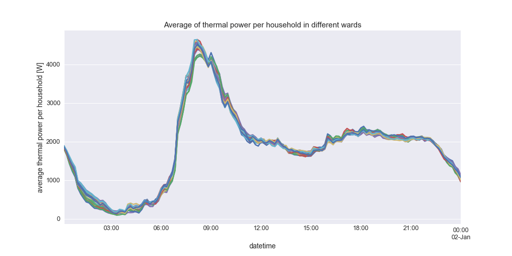
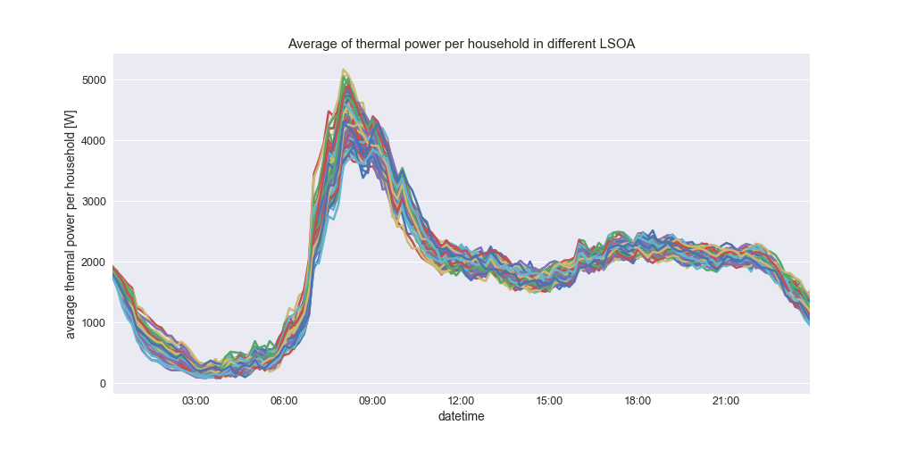
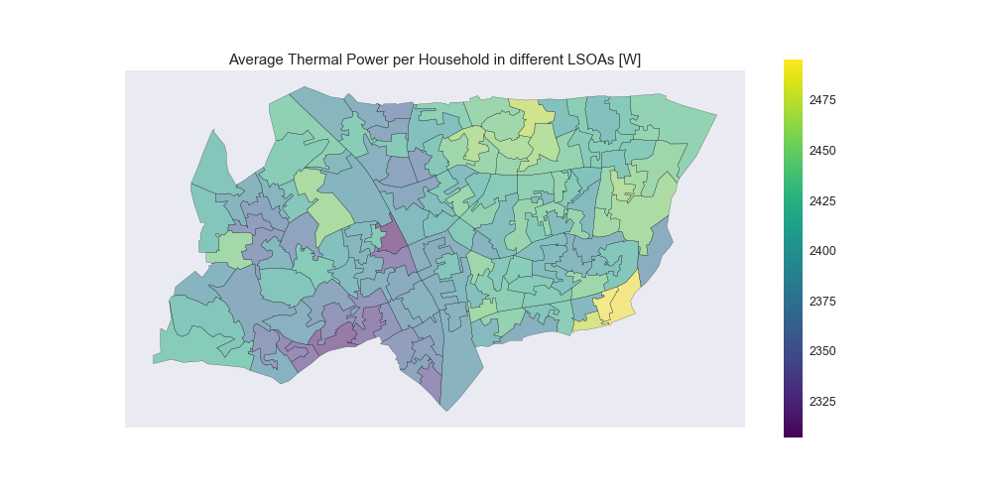
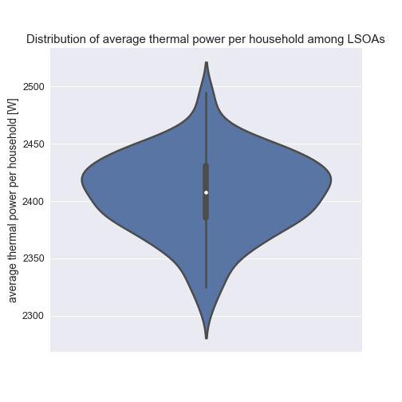
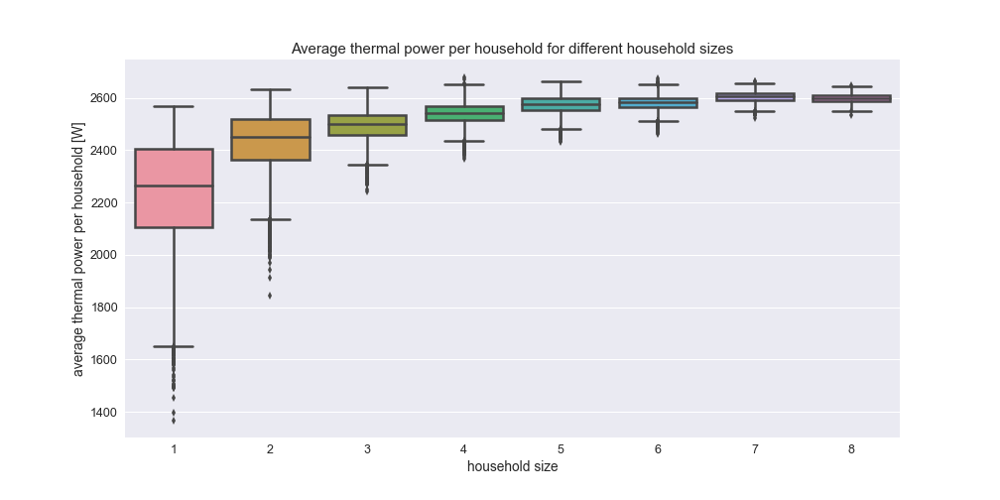

# Introduction and Related Works

Accounting for 34% of global energy end-use, the building sector is the largest energy sink and a major contributor to global CO~2~ emissions [@GEA:2012us]. Three quarters of this amount are accountable for space heating and cooling purposes. When trying to reduce this energy impact as it is done by the European Union [@Parliament:2012ut] understanding the energy demand originating in the building sector and its drivers is crucial. With more than half of the global population living in cities and with on-going urbanisation [@UnitedNations:2014uy], urban build environments are becoming more important in this regard. This is even more so true when looking at America or Europe where the urban population exceeds 70% of the total population already today [@UnitedNations:2014uy]. Estimations of energy demand for space heating are valuable during the design phase of urban build environment and its energy supply infrastructure, but also for effective retrofitting actions and performance evaluations. In particular the task of designing efficient energy supply systems asks for a high temporal resolution of the estimation [@Omu:0ca]. The built infrastructure and other factors impacting energy demand for space heating are diversely distributed in urban environments and hence analyses have recently been done on a high spatial resolution as well [@Choudhary:0kp; @Li:wp; @Anonymous:0gi].

While thermodynamic models of buildings are well understood and assumed to achieve good results, simulated energy demand for space heating in urban environments deviate largely from measured data which is often accounted to micro-climate effects [@Kolokotroni:2008kg; @Steemers:2003kd] and to the impact of occupants [@GuerraSantin:2012im; @Seryak:2003hn; @Fabi:2012gu; @Janda:2011cy]. "Buildings don't use energy: people do" [@Janda:2011cy] and hence the energy usage in a building can be accounted directly or indirectly to the way people use buildings. In residential homes people's impact on space heating demands stems mostly from the way people control the heating, cooling, and ventilation (HVAC) systems, the way people actively ventilate their buildings through window and door opening, the way people shade their rooms through blinds and curtains, the way people functionally divide their residential homes, and people's occupancy and activities performed at home which attribute in the form of heat gains [@VanRaaij:1983kt; @Paauw:2009uw]. Given the complex nature of human behaviour a comprehensive understanding of the driving forces, relationships, and feedbacks is difficult, several factors like awareness [@Janda:2011cy], socio-economic situations [@Druckman:2009kx], and rebound effects are discussed [@Edelson:1980gj; @Brannlund:2007jg]. Given the trend towards zero-energy buildings in which thermal losses are largely reduced, the impact of occupants on energy demand is relatively increasing [@Janda:2011cy] stressing the importance to account for and understand the relationships.

Several methods for modelling energy demand in buildings have been proposed. Swan and Ugursal [@Swan:2009fb] differentiate methods for modelling end-use energy demand in the residential sector into those following a top-down approach, and those following a bottom-up approach, depending on whether input data from the hierarchical level below the system under consideration is incorporated or not. For the bottom up models a differentiation is made between statistical methods in which historic consumption data is regressed onto explaining variables, and those which incorporate physical models of the building envelope and the thermodynamic processes in them which are typically referred to as engineering methods. While the data driven methods yield models that can be applied to buildings of the same archetype, only the latter allows to simulate so far unseen effects, e.g. through the introduction of new technologies. Occupants must be modelled explicitly in engineering models. On the city scale, former work include high resolution building by building models without explicit influence of occupancy [@tian2015high; @zhang2015gshp; @Li:wp], and models including people behaviour but only in aggregated form on lower spatial resolution [@BustosTuru:2016ee].

The comprehensive behaviour of occupants is typically tried to represent through several sub-models. A foundation to most of them form occupancy models determining at which point of time the building is occupied [@Richardson:2008dj; @Aerts:2015ko; @Widen:2009fo]; sometimes even disaggregated into zones of the building [@Liao:2012et]. On top of those, activity models [@Widen:2009kx; @Aerts:2015ko], window opening models [@Andersen:2013cn; @Fabi:2013tl], and HVAC control models [@Fabi:2013ch] are placed. Behaviour models are typically differentiated between deterministic and probabilistic types. Deterministic models assume a direct causal link between a driver of a certain behaviour and the actual derived action. While different methods exist, these types of models are based on rational decision making. Probabilistic models in contrast are based on likelihoods of different actions. The data source for occupancy and activity models form in many cases so called time use survey (TUS) data sets for which a standardising research centre exists [@ctus].

This paper reports the progress of on-going work of introducing models of people behaviour to high resolution bottom up city models. The model estimates energy demand for space heating in residential buildings on a city scale. Energy demand is driven by the occupancy of people in their household which itself is modelled through a time-heterogeneous markov-chain based on TUS data. Citizens are clustered through features of themselves and their households they live in. A statistically viable urban population is formed through population synthesis. The model allows to analyse spatial patterns of energy use for space heating. It is implemented as an open-source agent-based model [@energyagents] which allows easy integration of other bottom-up effects impacting energy demand for space heating like people movement, people interactions, activity models, and urban microclimates, other energy uses like water heating and electricity, other environmental impacts e.g. on air quality, or the supply side of building energy.

This paper is structured as follows: section 2 describes the conceptual model and a general way how time use data and census data can be used to calibrate it. Simulation results for a case study of Haringey, a borough of London are presented in section 3, and section 4 concludes the findings.

# Methodology

## Conceptual Model

The general urban energy system as applied in this study consists of three distinct entities: citizens, HVAC controls, and dwellings whose models will be described in detail in the following sub sections. A dwelling forms a home for one to $n$ citizens and incorporates exactly one HVAC control system. [Fig. 1](#model-overview) shows a flow-chart of the model. The model is time-step based where in each time step $k$, each entity updates its state: first all citizen update their occupancy, i.e. determine whether they are at home or not. Second, the HVAC control system of each dwelling updates its heating set point, potentially taken into account the occupancy of the dwelling. Lastly, each dwelling updates its indoor temperature and the thermal power needed for reaching it.

{#model-overview .class width=500}

### Model of Heating System Control

* generally, the heating set point for a heating Zone z can be described by $\theta_{set, z} = \theta_{set, z}(L_{P_z}, A_{P_z}, B_{P_z})$, where:

    * $P_z$: set of people inside the heating zone or related to it
    * $L_{P_z}$: location of People $P_z$
    * $A_{P_z}$: activity of People $P_z$
    * $B_{P_z}$: heating behaviour (comfort zone, awareness, financial situation, usage pattern) of People $P_z$

Here the following simplifications are made compared to the general model above:

* zones = entire dwellings
* location = presence
* discrete time with steps of 10 min length
* heating behaviour ignored

This leads to the simplified dynamic model of a heating set point for a dwelling d:

$\theta_{set, d, k} = \begin{cases}
    \text{off},             & \text{if } P_{d, k} = \varnothing\\
    \theta_{set, active},   & \text{if } \{p \in P_{d, k} | \text{p is active}\} \neq \varnothing\\
    \theta_{set, passive},  & \text{otherwise}
\end{cases}$

where:

* $k \in K = \text{{all time steps}}$
* $P_{d, k} = \{p \in P_d | \text{p is in dwelling d at time step k}\}$
* $\theta_{set, active}$: assumed static set point whenever dwelling is occupied by at least one active person
* $\theta_{set, passive}$: assumed static set point whenever dwelling is occupied by only passive people

### People Model

Time heterogeneous markov chain with the following states:

* not at home
* active at home
* asleep at home

### Thermal Model of Dwelling

Simplified 1 zone building energy model.

The model is derived from the hourly dynamic model in ISO 13790. It has only one capacity and one resistance.

Compared to the ISO 13790 there is

* only metabolic heat gain,
* full shading of the building, no direct or indirect sun light,
* no windows or doors,
* no ventilation,
* immediate heat transfer between air and surface.

{#simple-simple .class width=300}

$\theta_{m, k} = \theta_{m, k-1} \cdot (1 - \frac{\Delta{t}}{C_{m}} \cdot H_{tr, em}) + \frac{\Delta{t}}{C_m} \cdot (\Phi_{HC, nd, k-1} + H_{tr, em} \cdot \theta_{e, k-1})$

where

<!--- FIXME many of the following not in equation --->
<!--- TODO add metabolic heat gain --->
* $\Phi_{HC, nd, t}$: cooling or heating power at time k
* $\theta_{m, k}$: building temperature [℃] at time k
* $\theta_{e, k}$: outside temperature [℃] at time k
* $A_f$: conditioned floor area [m^2^]
* $C_m$: capacity of the building's heat mass [J/K]
* $\Delta{t}$: time step size [s]
* $H_{tr, em}$: heat transmission to the outside [W/K]
* $\theta_{int, set}$: heating set point temperature [℃]
* $\Phi_{max}$: maximum heating power [W]

## Simulation Platform

agent based simulation

## Model Calibration

### People Model

using time use survey data: cluster set of people by certain attributes (for example work status, role in household, household income, ...) and derive markov chain for all cluster of people.

The clustering must use and retain the features that will later be used for the synthetic population.

Possible procedure:

* create a people-model time series for each individual in the time use survey
* through feature selection identify the features of individuals that explain their day time series best using Cramer's V
* start selecting features starting from the most important one, as long as the remaining cluster will stay large enough (must be at at least > 20) (maybe using ANOVA, analysis of variance)
* cluster people by those features (simply by their different values) and calculate markov chain for all cluster
* (later below: use those features as control features for the synthetic population)

Discuss difficulty of problem: there is no _correct_ way of doing this.

### Synthetic Population {#synthetic_population}

Synthetic population using Hierarchical Iterative Proportional Fitting: fitting households and individuals at the same time

### Building Energy Model

Using the same model for each dwelling

Rational for using the exact same model for each dwelling: this can be seen similar to the normative building energy assessment where the object of study is the building and its impact on energy demand. Heating behaviour is considered external *and always equal*. Here, the object of study is the heating behaviour of people and its impact on energy demand. The building could be considered external *and always equal*.

## Assumptions

summary of assumptions

# Case Study

short intro to London Haringey

describe data sets: UK Time Use Survey 2000, Census 2011

## Feature Selection Results

Discuss correlation of features between features and to the time series.

## Simulation Results

### Results for Time Triggered Strategy (optional)

### Results for Preferred Features

* discuss variation between wards in terms of energy usage and in terms of dynamic load profile

### Results for Alternative Feature Selection

# Discussion & Conclusion

# References <!--- filled automatically by pandoc --->
